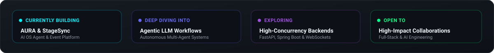
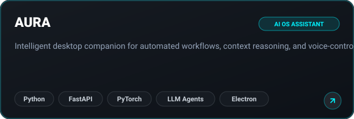
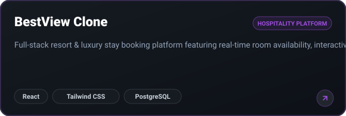
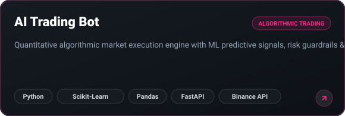
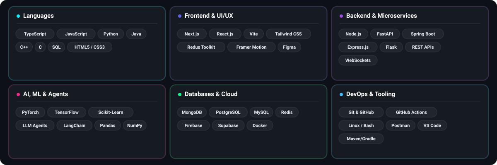
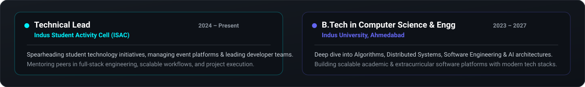
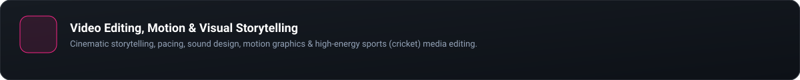

<!-- ============================================================ -->
<!-- HERO SECTION                                                 -->
<!-- ============================================================ -->

  <picture>
    <source media="(prefers-color-scheme: dark)" srcset="./assets/banner-dark.svg" />
    <source media="(prefers-color-scheme: light)" srcset="./assets/banner-light.svg" />
    
  </picture>

<!-- ============================================================ -->
<!-- INTRO & QUICK CONNECT PILLS                                  -->
<!-- ============================================================ -->

  Computer Science undergraduate at <b>Indus University</b> ('27) and Technical Lead at <b>ISAC</b>. 
  Specializing in scalable full-stack architectures, high-performance microservices, and autonomous LLM agent systems. 
  Passionate about turning complex computational problems into elegant, production-grade software.

  <a href="https://linkedin.com/in/abhi-patel-dev" target="_blank" rel="noopener noreferrer">
    <picture>
      <source media="(prefers-color-scheme: dark)" srcset="./assets/btn-linkedin-dark.svg" />
      <source media="(prefers-color-scheme: light)" srcset="./assets/btn-linkedin-light.svg" />
      
    </picture>
  </a>
  <a href="https://github.com/abhipatel0000" target="_blank" rel="noopener noreferrer">
    <picture>
      <source media="(prefers-color-scheme: dark)" srcset="./assets/btn-github-dark.svg" />
      <source media="(prefers-color-scheme: light)" srcset="./assets/btn-github-light.svg" />
      
    </picture>
  </a>
  <a href="mailto:abhipatel200510@gmail.com" target="_blank" rel="noopener noreferrer">
    <picture>
      <source media="(prefers-color-scheme: dark)" srcset="./assets/btn-email-dark.svg" />
      <source media="(prefers-color-scheme: light)" srcset="./assets/btn-email-light.svg" />
      
    </picture>
  </a>
  <a href="https://instagram.com/abhipatel1810" target="_blank" rel="noopener noreferrer">
    <picture>
      <source media="(prefers-color-scheme: dark)" srcset="./assets/btn-instagram-dark.svg" />
      <source media="(prefers-color-scheme: light)" srcset="./assets/btn-instagram-light.svg" />
      
    </picture>
  </a>
  <!-- TODO: Replace href below with your personal portfolio URL when published -->
  <a href="https://github.com/abhipatel0000" target="_blank" rel="noopener noreferrer">
    <picture>
      <source media="(prefers-color-scheme: dark)" srcset="./assets/btn-portfolio-dark.svg" />
      <source media="(prefers-color-scheme: light)" srcset="./assets/btn-portfolio-light.svg" />
      
    </picture>
  </a>

<!-- ============================================================ -->
<!-- CURRENT FOCUS CARD                                           -->
<!-- ============================================================ -->

  <picture>
    <source media="(prefers-color-scheme: dark)" srcset="./assets/currently-dark.svg" />
    <source media="(prefers-color-scheme: light)" srcset="./assets/currently-light.svg" />
    
  </picture>

 

<!-- ============================================================ -->
<!-- FEATURED PROJECTS (2x2 Grid)                                -->
<!-- ============================================================ -->
<picture>
  <source media="(prefers-color-scheme: dark)" srcset="./assets/header-projects-dark.svg" />
  <source media="(prefers-color-scheme: light)" srcset="./assets/header-projects-light.svg" />
  
</picture>

<table width="100%" border="0" cellspacing="0" cellpadding="4">
  <tr>
    <td width="50%" align="center" valign="top">
      <!-- TODO: Replace href with your AURA repository link -->
      <a href="https://github.com/abhipatel0000" target="_blank" rel="noopener noreferrer">
        <picture>
          <source media="(prefers-color-scheme: dark)" srcset="./assets/project-aura-dark.svg" />
          <source media="(prefers-color-scheme: light)" srcset="./assets/project-aura-light.svg" />
          
        </picture>
      </a>
    </td>
    <td width="50%" align="center" valign="top">
      <!-- TODO: Replace href with your StageSync repository link -->
      <a href="https://github.com/abhipatel0000" target="_blank" rel="noopener noreferrer">
        <picture>
          <source media="(prefers-color-scheme: dark)" srcset="./assets/project-stagesync-dark.svg" />
          <source media="(prefers-color-scheme: light)" srcset="./assets/project-stagesync-light.svg" />
          
        </picture>
      </a>
    </td>
  </tr>
  <tr>
    <td width="50%" align="center" valign="top">
      <!-- TODO: Replace href with your BestView repository link -->
      <a href="https://github.com/abhipatel0000" target="_blank" rel="noopener noreferrer">
        <picture>
          <source media="(prefers-color-scheme: dark)" srcset="./assets/project-bestview-dark.svg" />
          <source media="(prefers-color-scheme: light)" srcset="./assets/project-bestview-light.svg" />
          
        </picture>
      </a>
    </td>
    <td width="50%" align="center" valign="top">
      <!-- TODO: Replace href with your AI Trading Bot repository link -->
      <a href="https://github.com/abhipatel0000" target="_blank" rel="noopener noreferrer">
        <picture>
          <source media="(prefers-color-scheme: dark)" srcset="./assets/project-tradingbot-dark.svg" />
          <source media="(prefers-color-scheme: light)" srcset="./assets/project-tradingbot-light.svg" />
          
        </picture>
      </a>
    </td>
  </tr>
</table>

 

<!-- ============================================================ -->
<!-- TECH ARSENAL                                                 -->
<!-- ============================================================ -->
<picture>
  <source media="(prefers-color-scheme: dark)" srcset="./assets/header-tech-dark.svg" />
  <source media="(prefers-color-scheme: light)" srcset="./assets/header-tech-light.svg" />
  
</picture>

  <picture>
    <source media="(prefers-color-scheme: dark)" srcset="./assets/tech-stack-dark.svg" />
    <source media="(prefers-color-scheme: light)" srcset="./assets/tech-stack-light.svg" />
    
  </picture>

 

<!-- ============================================================ -->
<!-- CONTRIBUTION GRAPH / SNAKE ANIMATION                         -->
<!-- ============================================================ -->
<picture>
  <source media="(prefers-color-scheme: dark)" srcset="./assets/header-snake-dark.svg" />
  <source media="(prefers-color-scheme: light)" srcset="./assets/header-snake-light.svg" />
  
</picture>

  <picture>
    <source media="(prefers-color-scheme: dark)" srcset="https://raw.githubusercontent.com/abhipatel0000/abhipatel0000/output/github-contribution-grid-snake-dark.svg" />
    <source media="(prefers-color-scheme: light)" srcset="https://raw.githubusercontent.com/abhipatel0000/abhipatel0000/output/github-contribution-grid-snake.svg" />
    
  </picture>

 

<!-- ============================================================ -->
<!-- EXPERIENCE & LEADERSHIP                                      -->
<!-- ============================================================ -->
<picture>
  <source media="(prefers-color-scheme: dark)" srcset="./assets/header-experience-dark.svg" />
  <source media="(prefers-color-scheme: light)" srcset="./assets/header-experience-light.svg" />
  
</picture>

  <picture>
    <source media="(prefers-color-scheme: dark)" srcset="./assets/experience-dark.svg" />
    <source media="(prefers-color-scheme: light)" srcset="./assets/experience-light.svg" />
    
  </picture>

 

<!-- ============================================================ -->
<!-- CREATIVE CORNER                                              -->
<!-- ============================================================ -->
<picture>
  <source media="(prefers-color-scheme: dark)" srcset="./assets/header-creative-dark.svg" />
  <source media="(prefers-color-scheme: light)" srcset="./assets/header-creative-light.svg" />
  
</picture>

  <!-- TODO: Replace href with your video portfolio / YouTube / creative reel link -->
  <a href="https://instagram.com/abhipatel1810" target="_blank" rel="noopener noreferrer">
    <picture>
      <source media="(prefers-color-scheme: dark)" srcset="./assets/creative-dark.svg" />
      <source media="(prefers-color-scheme: light)" srcset="./assets/creative-light.svg" />
      
    </picture>
  </a>

 

<!-- ============================================================ -->
<!-- FOOTER                                                       -->
<!-- ============================================================ -->

  <picture>
    <source media="(prefers-color-scheme: dark)" srcset="./assets/footer-dark.svg" />
    <source media="(prefers-color-scheme: light)" srcset="./assets/footer-light.svg" />
    
  </picture>

