<p align="center">
  
</p>

<p align="center">
  
  
  
</p>

---

## 🧑‍💻 About Me

```js
const abhi = {
  role: "B.Tech CSE Student @ Indus University (2023 – 2027)",
  location: "Ahmedabad, Gujarat, India 🇮🇳",
  experience: "Technical Lead @ ISAC (Indus Student Activity Cell)",
  focus: ["Full-Stack Web", "Mobile Apps", "AI-powered tools"],
  currentlyBuilding: "Projects that solve real problems, end to end",
  funFact: "I also create cricket content & edit videos 🏏🎬",
  lookingFor: "Internships, collaborations & open-source opportunities",
};
```

- 🔭 Currently building full-stack and mobile projects independently
- 🌱 Exploring AI integrations, system design and clean architecture
- 🤝 Open to collaborating on interesting ideas
- ⚡ Ask me about web development, app development or project architecture

---

## 🛠️ Tech Stack

<table align="center">
  <tr>
    <td align="center"><b>Languages</b></td>
    <td></td>
  </tr>
  <tr>
    <td align="center"><b>Frontend</b></td>
    <td><br /> </td>
  </tr>
  <tr>
    <td align="center"><b>Backend</b></td>
    <td><br /> </td>
  </tr>
  <tr>
    <td align="center"><b>Databases</b></td>
    <td></td>
  </tr>
  <tr>
    <td align="center"><b>Data &amp; ML</b></td>
    <td><br />   </td>
  </tr>
  <tr>
    <td align="center"><b>Tools &amp; DevOps</b></td>
    <td><br />  </td>
  </tr>
</table>

---

## 📊 GitHub Stats

<p align="center">
  
  
</p>

<p align="center">
  
</p>

---

## 🤝 Let's Connect

<p align="center">
  <a href="https://www.linkedin.com/in/abhi-patel-dev"></a>
  <a href="mailto:abhipatel200510@gmail.com"></a>
  <a href="https://www.instagram.com/abhipatel1810"></a>
</p>

<p align="center">
  <i>⭐ If you like my work, consider giving a star to my repositories!</i>
</p>

<p align="center">
  
</p>
